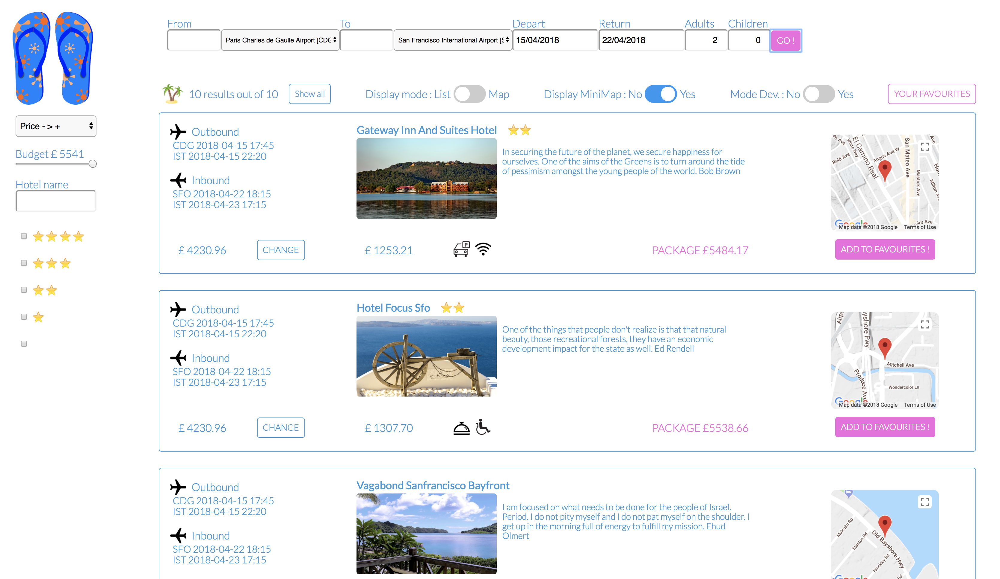
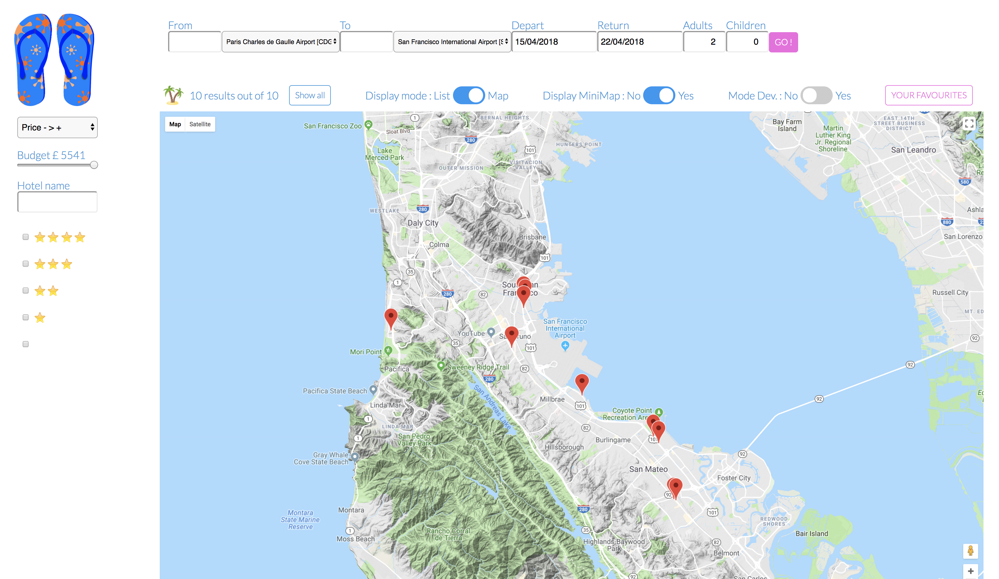
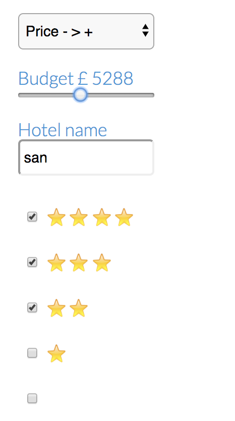
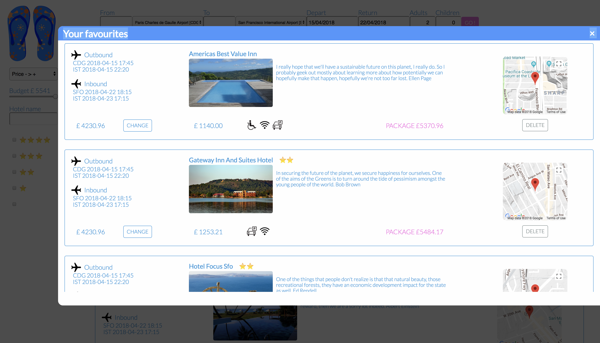

# CodeClan Group Project
One-week project to build from scratch in team a flight and hotel price comparison web application using multiple APIs + ExpressJS + MongoDB.

# Team
Colaboration between:
- https://github.com/BlueMorning
- https://github.com/markywildtype
- https://github.com/NTERPRYZ
- https://github.com/rossghill

Through this project we work with agile methods.
We managed to save time by splitting the tasks between pair temas with a blackbox approach. Indeed, the output of one team was always the input of the other team. Through this approach we managed to avoid functional or code overlapping while progressing in parallel because we knew what inputs and outputs we could rely on without having them available yet. Thus, it was possible to simulate them.

# Technical stack
- Frontend with HTML5, CSS3 and vanilla JS.
- Backend with ExpressJS
- Data persistence with MongoDB
- API used :
  - Amadeus sandbox API for flights and hotels
  - Pixabay API for images
  - Talaikis API for hotel description with quotes

# Application description
## At a glance
The FlightR application builds and displays travel package offers depending on the user's criteria. To build the travel packages we call twice the Amadeus API which provides flight and hotel proposals then we select the cheapest flight and pair it with all the available hotels. Hotel images come from the Pixabay API and hotel descriptions come from the Talaikis API. In order to increase the performances we call all the API in parallel instead of calling them in a sequencial mode.

## HomePage
We wanted the hompage to be as simple as possible to provide fast results to the client. Thus, our apporach was to ask for a few mandadory criteria first and then let the client refine his/her search with extra filters.

## ResultPage
Because clients care much more of the hotel than the flight we decided to provide travel package by pairing the cheapest flight with all the available hotels. Thus the total price is reduced avoiding losing client whose budget is limited.
By default, the travel packages are presented through a list with a ascending sort on price packages.

### List of results
For each travel package, essential information are provided like : 
- the flight inbound and outbound details and price
- the hotel description and price
- the package total price
- the hotel location spotted on a Google Map

### Results displayed on GoogleMap
Hotel locations can be displayed on a Google Map to help clients compare and decide what would be their best option. To get further information on a travel package the client can click on the hotel pinpoint.

### Extrafilters on results
The extrafilters allow the client to refine his/her search on criteria such as the budget, the name of the hotel and its star rating. Furthermore, extended sorting options are proposed like : ascending/descending price, ascending/descending hotel star rating to enbale the client to focus on his/her priorities.

### Add/Remove travel packages to favourites
When a travel package draws the client's attention then he/she can save it in the his/her favourites list. The favourite list works like a caddy, it represents the step before the checking out. Travel packages can also be removed from the favourites list.

